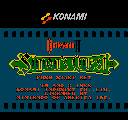
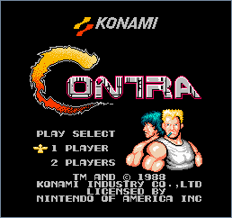
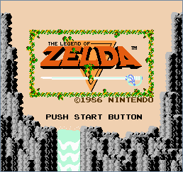
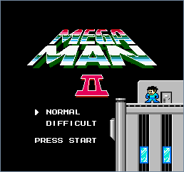
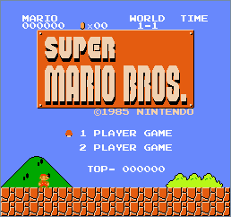
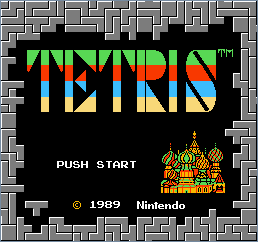

# neso-web

A web interface to [`neso-rs`](https://gitlab.com/jeffrey-xiao/neso-rs).

## Screenshots

## License

`neso-web` is distributed under the terms of both the MIT License and the Apache License (Version
2.0).

See [LICENSE-APACHE](LICENSE-APACHE) and [LICENSE-MIT](LICENSE-MIT) for more details.
